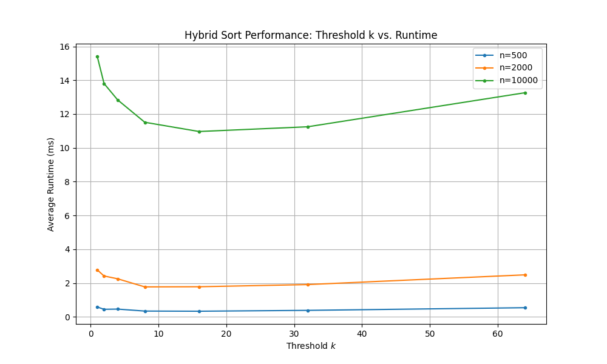

# Question 2

### Part A - Implementation:

All code made in hybrid_sort.py, check said file for comments to see my implementation.

### Part B - Experimentation and Analysis:

Parts 1-4 done in code.

Here is the plot with the results of running my code:

5. As can be seen in the plot above, especially for n=10,000, the optimal value of k is 16, as that is where each array size took the least amount of time to run.

6. An optimal threshold exists because with k too large or too small, hybrid_sort is only really running one of the sort methods, not getting the advantages of both.
For very small values of k, it is primarily merge sort that is being used so there is a lot of recursion, which adds a lot of overhead since merge sort does not have great space complexity ($O(n)$).
For very large values of k, insertion sort is primarily being used, and since insertion sort has a time complexity of $O(n^{2})$, this can take a lot of time.